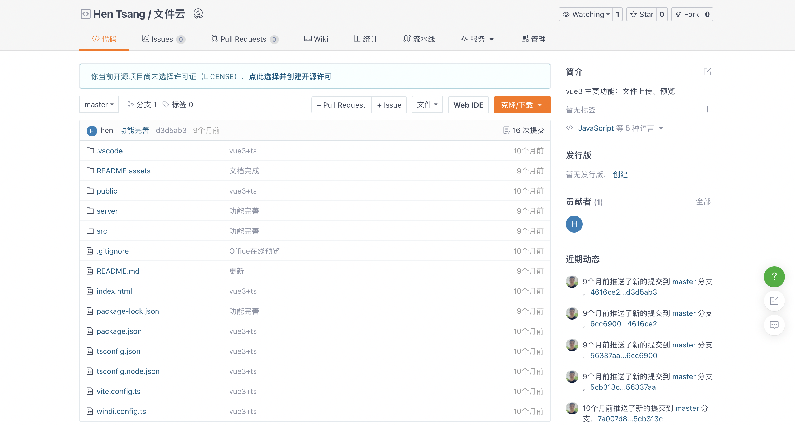
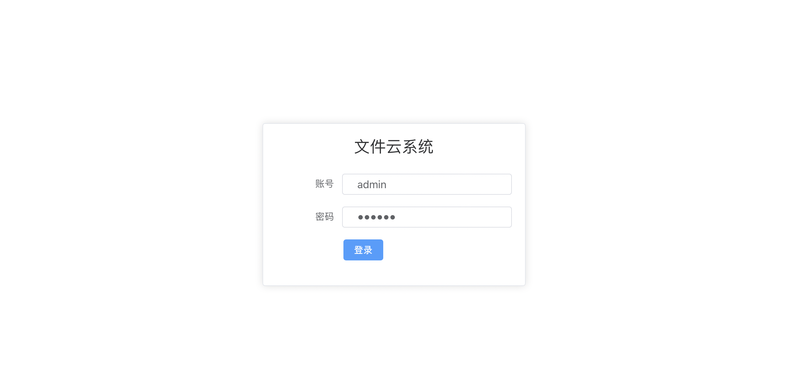
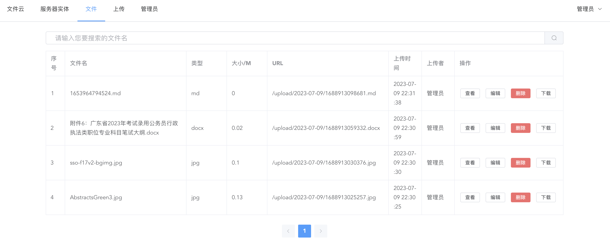
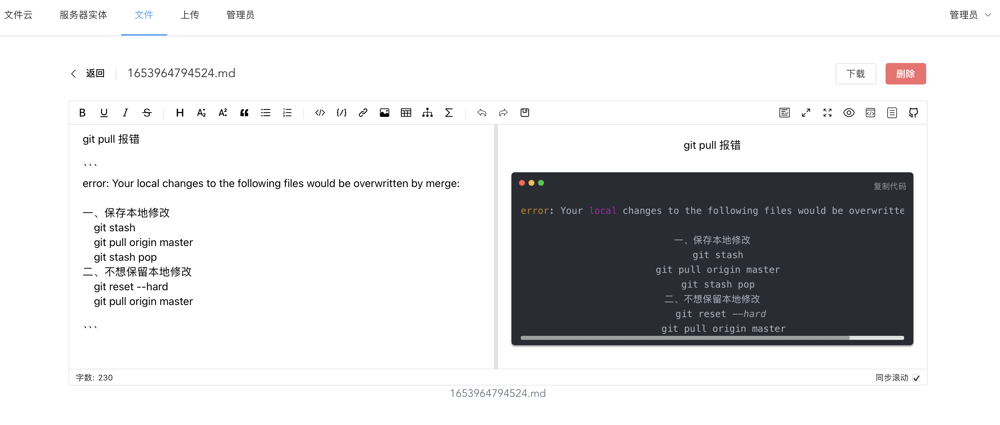
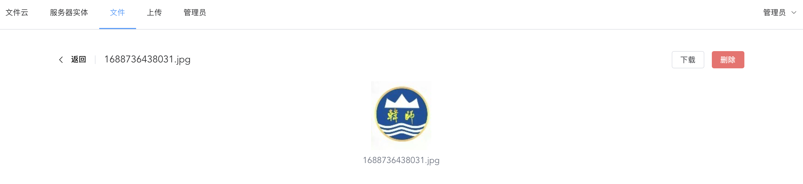
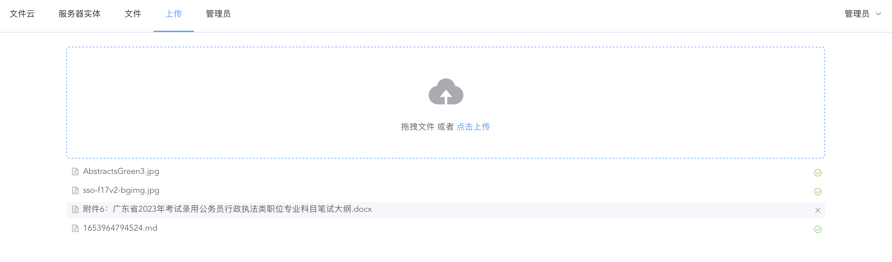
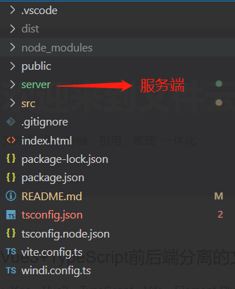
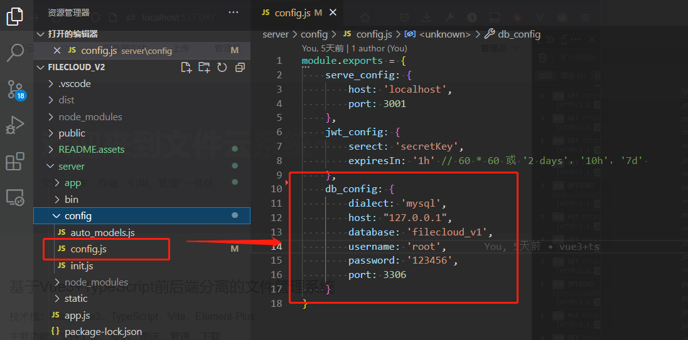
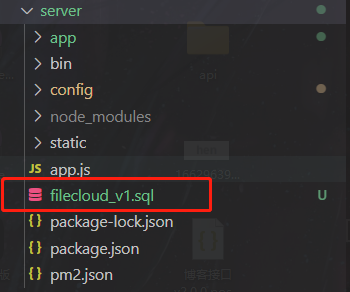

# 基于vue3+ts+vite的文件管理系统

地址🧭 [https://gitee.com/hen128/file-cloud](https://gitee.com/hen128/file-cloud)


## 写在前沿

关键字：Koa，Vue3，TypeScript，Vite，Element-Plus、Windi.css..

功能：文件上传、预览、图床、管理、下载、Office在线预览



## 预览

**登录**

账号：admin 密码：123456



**文件列表**



**文件预览**





**文件上传**



## 启动

前端：

```
npm i

npm run dev

```

后端：

```
同上
```


## 说明

- server目录存放服务端代码

  

- server/config/config.js 配置数据库等信息

  

- 数据表文件

  
