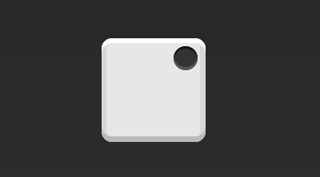
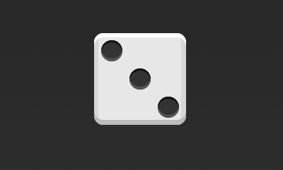

# Flex布局复习-骰子

参考：[阮一峰：Flex 布局教程：实例篇]: http://www.ruanyifeng.com/blog/2015/07/flex-examples.html


## 单项目



```css
.box {
  display: flex;
  justify-content: flex-end;
}
```


```
.box {
  display: flex;
  justify-content: center;
  align-items: flex-end;
}
```


```
.box {
  display: flex;
  justify-content: flex-end;
  align-items: flex-end;
}
```

## 双项目


```
.box {
  display: flex;
  flex-direction: column;
  justify-content: space-between;
}
```


```
.box {
  display: flex;
  flex-direction: column;
  justify-content: space-between;
  align-items: center;
}
```


```
.box {
  display: flex;
  flex-direction: column;
  justify-content: space-between;
  align-items: flex-end;
}
```


```
.box {
  display: flex;
}

.item:nth-child(2) {
  align-self: center;
}
```


```
.box {
  display: flex;
  justify-content: space-between;
}

.item:nth-child(2) {
  align-self: flex-end;
}
```

## 三项目



```
.box {
  display: flex;
}

.item:nth-child(2) {
  align-self: center;
}

.item:nth-child(3) {
  align-self: flex-end;
}
```

## 四项目


```
.box {
  display: flex;
  flex-wrap: wrap;
  justify-content: flex-end;
  align-content: space-between;
}
```


```
<div class="box">
  <div class="column">
    <span class="item"></span>
    <span class="item"></span>
  </div>
  <div class="column">
    <span class="item"></span>
    <span class="item"></span>
  </div>
</div>
```

```
.box {
  display: flex;
  flex-wrap: wrap;
  align-content: space-between;
}

.column {
  flex-basis: 100%;
  display: flex;
  justify-content: space-between;
}
```

## 六项目


```
.box {
  display: flex;
  flex-wrap: wrap;
  align-content: space-between;
}
```


```
.box {
  display: flex;
  flex-direction: column;
  flex-wrap: wrap;
  align-content: space-between;
}
```


```
<div class="box">
  <div class="row">
    <span class="item"></span>
    <span class="item"></span>
    <span class="item"></span>
  </div>
  <div class="row">
    <span class="item"></span>
  </div>
  <div class="row">
     <span class="item"></span>
     <span class="item"></span>
  </div>
</div>
```

```
.box {
  display: flex;
  flex-wrap: wrap;
}

.row{
  flex-basis: 100%;
  display:flex;
}

.row:nth-child(2){
  justify-content: center;
}

.row:nth-child(3){
  justify-content: space-between;
}
```

## 九项目


```
.box {
  display: flex;
  flex-wrap: wrap;
}
```

## 预览

```
<!DOCTYPE html>
<html lang="en">

<head>
    <meta charset="UTF-8">
    <meta http-equiv="X-UA-Compatible" content="IE=edge">
    <meta name="viewport" content="width=device-width, initial-scale=1.0">
    <title>Document</title>
</head>
<style>
    body {
        background-color: #232323;
    }

    h2 {
        color: #e7e7e7;
    }

    .box {
        margin: 16px;
        padding: 4px;
        width: 104px;
        height: 104px;
        object-fit: contain;
        background-color: #e7e7e7;
        border-radius: 10px;
        box-shadow:
            inset 0 5px white,
            inset 0 -5px #bbb,
            inset 5px 0 #d7d7d7,
            inset -5px 0 #d7d7d7;
    }

    .item {
        display: block;
        width: 26px;
        height: 26px;
        border-radius: 50%;
        margin: 4px;
        background-color: #333;
        box-shadow: inset 0 3px #111, inset 0 -3px #555;
    }

    .box2 {
        display: flex;
        justify-content: center;
    }

    .box3 {
        display: flex;
        justify-content: flex-end;
    }

    .box4 {
        display: flex;
        align-items: center;
    }

    .box5 {
        display: flex;
        justify-content: center;
        align-items: center;
    }

    .box6 {
        display: flex;
        justify-content: center;
        align-items: flex-end;
    }

    .box7 {
        display: flex;
        justify-content: space-between;
    }

    .box8 {
        display: flex;
        flex-direction: column;
        justify-content: space-between;
    }

    .box9 {
        display: flex;
        flex-direction: column;
        justify-content: space-between;
        align-items: center;
    }

    .box10 {
        display: flex;
        flex-direction: column;
        justify-content: space-between;
        align-items: flex-end;
    }

    /* 二项目 */
    .box11 {
        display: flex;
    }

    .box11 .item:nth-child(2) {
        align-self: center;
    }

    .box12 {
        display: flex;
        justify-content: space-between;
    }

    .box12 .item:nth-child(2) {
        align-self: flex-end;
    }

    /* 三项目 */
    .box13 {
        display: flex;
    }

    .box13 .item:nth-child(2) {
        align-self: center;
    }

    .box13 .item:nth-child(3) {
        align-self: flex-end;
    }

    /* 四项目 */
    .box14 {
        display: flex;
        flex-wrap: wrap;
        align-content: space-between;
        justify-content: flex-end;
    }

    .box15 {
        display: flex;
        flex-wrap: wrap;
        align-content: space-between;
    }

    .box15 .column {
        flex-basis: 100%;
        display: flex;
        justify-content: space-between;
    }

    .box16 {
        display: flex;
        flex-wrap: wrap;
        align-content: space-between;
    }

    .box17 {
        display: flex;
        flex-direction: column;
        flex-wrap: wrap;
        align-content: space-between;
    }

    .box18 {
        display: flex;
        flex-wrap: wrap;
    }

    .box18 .row {
        flex-basis: 100%;
        display: flex;
    }

    .box18 .row:nth-child(2) {
        justify-content: center;
    }

    .box18 .row:nth-child(3) {
        justify-content: space-between;
    }

    /* 九项目 */
    .box19 {
        display: flex;
        flex-wrap: wrap;
    }
</style>

<body>
    <div class="box">
        <span class="item"></span>
    </div>
    <div class="box box2">
        <span class="item"></span>
    </div>
    <div class="box box3">
        <span class="item"></span>
    </div>
    <div class="box box4">
        <span class="item"></span>
    </div>
    <div class="box box5">
        <span class="item"></span>
    </div>
    <div class="box box6">
        <span class="item"></span>
    </div>
    <h2>双项目</h2>
    <div class="box box7">
        <span class="item"></span>
        <span class="item"></span>
    </div>
    <div class="box box8">
        <span class="item"></span>
        <span class="item"></span>
    </div>
    <div class="box box9">
        <span class="item"></span>
        <span class="item"></span>
    </div>
    <div class="box box10">
        <span class="item"></span>
        <span class="item"></span>
    </div>
    <div class="box box11">
        <span class="item"></span>
        <span class="item"></span>
    </div>
    <div class="box box12">
        <span class="item"></span>
        <span class="item"></span>
    </div>
    <h2>三项目</h2>
    <div class="box box13">
        <span class="item"></span>
        <span class="item"></span>
        <span class="item"></span>
    </div>
    <h2>四项目</h2>
    <div class="box box14">
        <span class="item"></span>
        <span class="item"></span>
        <span class="item"></span>
        <span class="item"></span>
    </div>
    <div class="box box15">
        <div class="column">
            <span class="item"></span>
            <span class="item"></span>
        </div>
        <div class="column">
            <span class="item"></span>
            <span class="item"></span>
        </div>
    </div>
    <h2>六项目</h2>
    <div class="box box16">
        <span class="item"></span>
        <span class="item"></span>
        <span class="item"></span>
        <span class="item"></span>
        <span class="item"></span>
        <span class="item"></span>
    </div>
    <div class="box box17">
        <span class="item"></span>
        <span class="item"></span>
        <span class="item"></span>
        <span class="item"></span>
        <span class="item"></span>
        <span class="item"></span>
    </div>
    <div class="box box18">
        <div class="row">
            <span class="item"></span>
            <span class="item"></span>
            <span class="item"></span>
        </div>
        <div class="row">
            <span class="item"></span>
        </div>
        <div class="row">
            <span class="item"></span>
            <span class="item"></span>
        </div>
    </div>
    <h2>九项目</h2>
    <div class="box box19">
        <span class="item"></span>
        <span class="item"></span>
        <span class="item"></span>
        <span class="item"></span>
        <span class="item"></span>
        <span class="item"></span>
        <span class="item"></span>
        <span class="item"></span>
        <span class="item"></span>
    </div>
</body>

</html>
```

