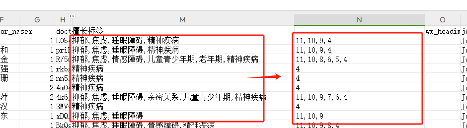

# node读取Excel

通过使用 `node-xlsx` ，读写Excel

背景：

根据下图，填入字段


需求：


编写脚本：

```js
var fs = require("fs");
var xlsx = require("node-xlsx");
var sheets = xlsx.parse("./t_doctor.xlsx"); // 文件路径

let newData = [];
let rowNum = 0;

// 字典
let mapArr = [
  {
    key: "抑郁",
    value: "11",
  },
  {
    key: "焦虑",
    value: "10",
  },
  {
    key: "睡眠障碍",
    value: "9",
  },
  {
    key: "情感障碍",
    value: "8",
  },
  {
    key: "亲密关系",
    value: "7",
  },
  {
    key: "儿童青少年期",
    value: "6",
  },
  {
    key: "老年期",
    value: "5",
  },
  {
    key: "精神疾病",
    value: "4",
  },
  {
    key: "内科",
    value: "3",
  },
  {
    key: "骨科",
    value: "2",
  },
  {
    key: "妇科",
    value: "1",
  },
];

let sheetResult = sheets[0].data; // 第一个sheet
sheetResult.forEach(function (row) { // 遍历每一行
  let item = row[12];
  if (typeof item === "string") {
    let tags = item.split(",");

    let strList = [];
    tags.forEach((tagItem, index) => {
      console.log(`病情${index + 1}：`, tagItem);
      mapArr.find((mapItem) => {
        if (mapItem.key == tagItem) {
          console.log("匹配：", mapItem.value);
          strList.push(mapItem.value);
        }
      });
    });
    let newStr = strList.join(",");
    console.log("写入值：", newStr);
    row[13] = newStr;
    rowNum++;
    newData.push(row);
    console.log("#### end ####\n");
  }
});
console.log("行数：", rowNum);
sheets[0].data = newData; // 获取更改的副本
fs.writeFileSync("./new4.xlsx", xlsx.build(sheets), "binary"); // 新文件路径
```

匹配值，写入编码：


效果如下：




